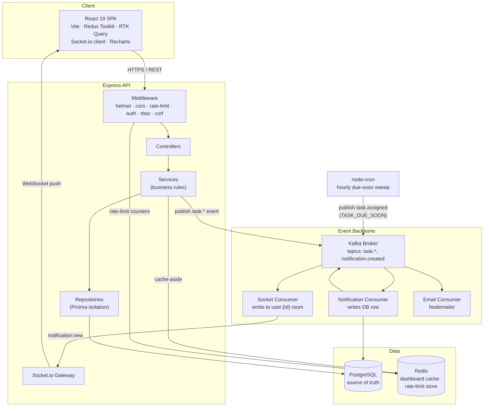
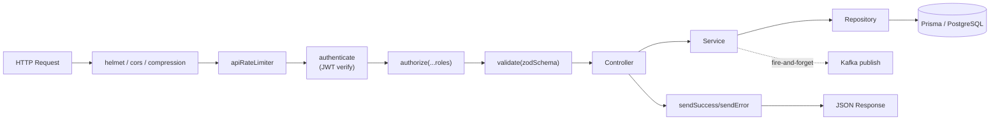
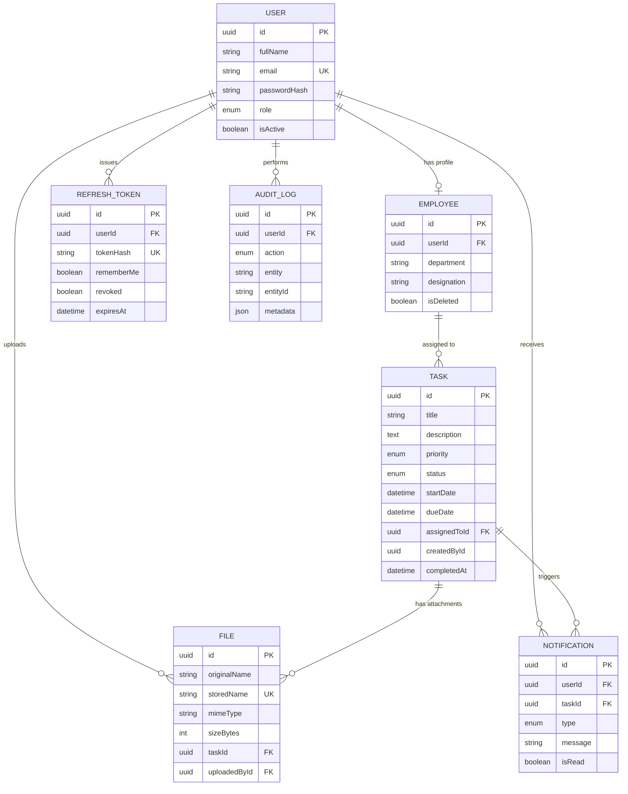
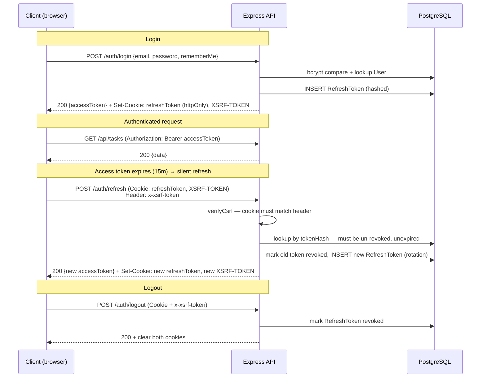
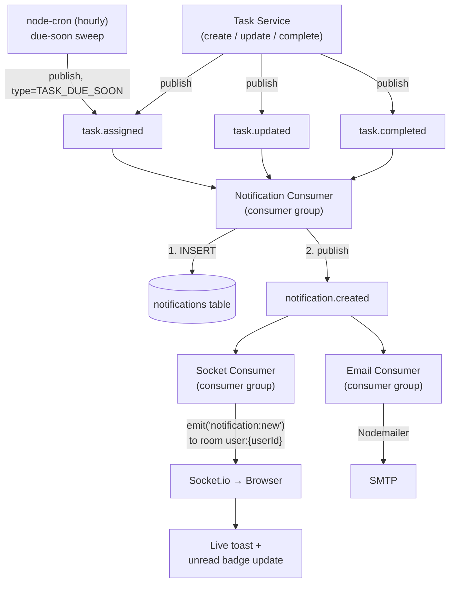
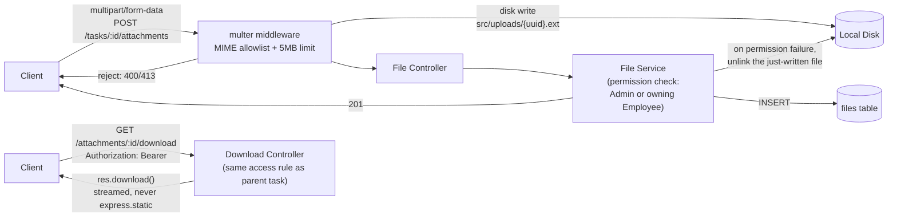
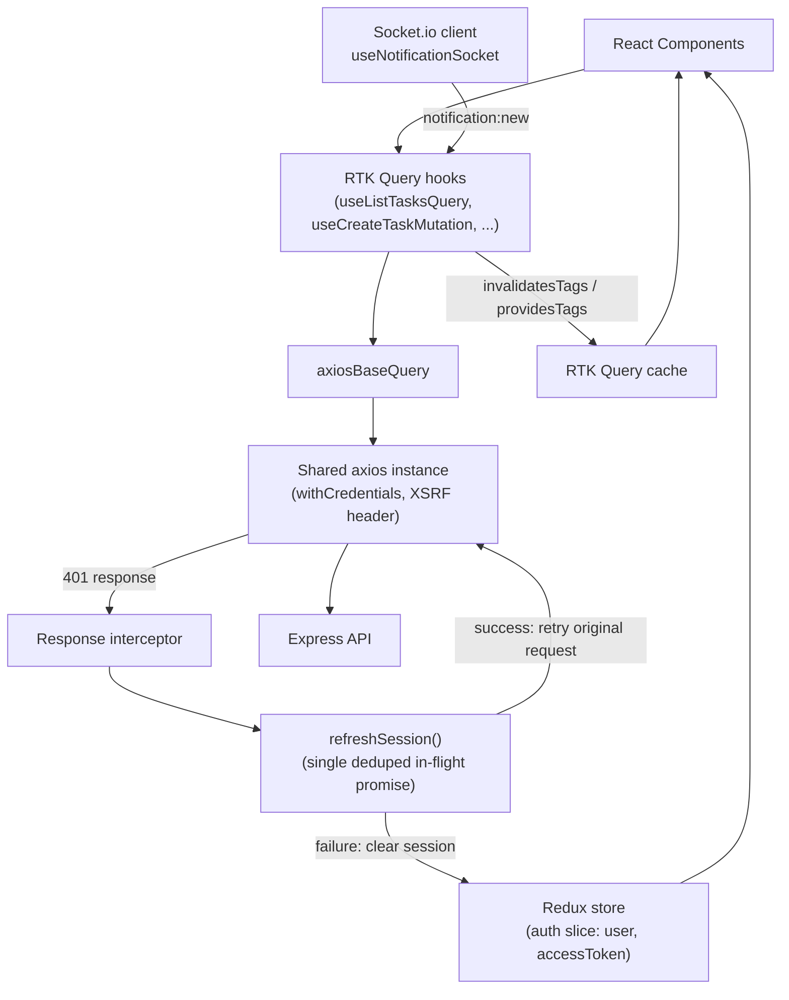

# Employee Task Management System — Architecture & Flow Diagrams

All diagrams below use standard Mermaid syntax and render natively on GitHub, in VS Code's
Markdown preview (with the Mermaid extension), or at [mermaid.live](https://mermaid.live).

---

## 1. System Architecture

**Why this shape:**
- Controllers stay thin; every business rule (e.g. "completed tasks can't be edited") lives in the **service layer**, testable in isolation from Express (see `tests/integration/task.test.ts`).
- **Repositories** isolate Prisma so services never import `@prisma/client` directly.
- Kafka decouples "a task was assigned" from "three things must happen as a result" (DB write, socket push, email). Adding a fourth side-effect later (e.g. a Slack webhook) means a new consumer group, zero changes to `task.service.ts`.
- Redis serves two independent purposes: response caching for read-heavy dashboard aggregates (60s TTL, explicitly invalidated on task mutations) and the rate limiter's counter store.

---

## 2. Request Lifecycle (Layered Architecture)

Every layer has exactly one job: middleware authenticates/authorizes/validates before the
handler runs; the controller only translates HTTP ⇄ service calls; the service holds every
business rule; the repository is the only place that talks to Prisma.

---

## 3. Database ER Diagram

Full DDL: [`docs/database.sql`](./database.sql). Prisma source of truth: [`E-Management-Backend/prisma/schema.prisma`](../E-Management-Backend/prisma/schema.prisma).

---

## 4. Authentication Flow

**Theft detection**: if a *revoked* refresh token is ever presented again (e.g. a stolen,
already-rotated cookie replayed by an attacker), the API revokes **every** token in that
user's chain, not just the one presented — forcing a full re-login everywhere.

**CSRF**: `/auth/refresh` and `/auth/logout` are the only two routes authenticated purely by
cookie (no bearer token to prove same-origin intent), so they're protected by a
double-submit cookie: the non-httpOnly `XSRF-TOKEN` cookie must match the `x-xsrf-token`
header. A cross-site attacker can trigger the request via the browser's ambient cookies,
but can't read the cookie's value to forge the matching header.

---

## 5. Kafka Event Flow (Notifications)

Three independent consumer groups subscribe to the same event stream — this is the concrete
proof of the fan-out: adding a fourth consumer (e.g. Slack) requires zero changes to the
task service, only a new consumer group.

**Why Kafka instead of a direct call**: the task mutation completes the instant the DB row
is written; it never blocks on — or fails because of — a slow SMTP server or a Socket.io
emit. All publishes from `task.service.ts` are deliberately fire-and-forget
(`void publishTaskAssigned(...)`), and every publish is wrapped in a try/catch so a Kafka
hiccup degrades to "no notification" rather than failing the user's request.

---

## 6. File Upload / Attachment Flow

Attachments are never served through `express.static` — every download goes through the
authenticated controller so the same Admin-or-owning-Employee rule that governs the parent
task also governs its files.

---

## 7. Frontend State & Data Flow

**Why one deduped `refreshSession()`**: both the axios 401-interceptor and the app-boot
silent-login hook (`useAuthBootstrap`) can trigger `POST /auth/refresh`. Two concurrent
calls would otherwise race on the same not-yet-rotated cookie — the first rotates and
revokes it, the second arrives holding an already-revoked token and trips theft-detection,
revoking the session it just legitimately established. This was a real bug caught via
Playwright browser testing (not just curl) early in the project; see `docs/PROJECT_PLAN.md`
Phase 1 notes for the full story.

---

## Related documents

- [`docs/PROJECT_PLAN.md`](./PROJECT_PLAN.md) — full phase-by-phase build log with verification evidence for every feature
- [`docs/database.sql`](./database.sql) — standalone SQL schema + seed data script
- `E-Management-Backend/prisma/schema.prisma` — Prisma schema (source of truth for the DB)
- `http://localhost:5001/api-docs` — Swagger/OpenAPI interactive API reference (when the backend is running)
