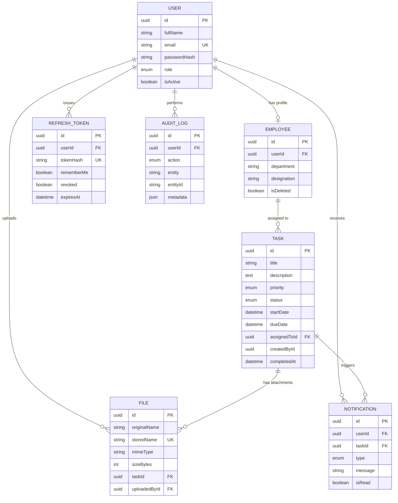

# Employee Task Management System — Architecture & Planning

Status: **Phase 3 (Task Management) complete.** Each remaining module is built and
delivered only after explicit sign-off, per the working agreement.

---

## 1. Complete Folder Structure

### Backend (`E-Management-Backend/`)

```
E-Management-Backend/
├── src/
│   ├── config/            # env loader, db client, redis client, kafka client, swagger config
│   ├── controllers/       # thin HTTP layer — parse req, call service, shape response
│   │   ├── auth.controller.ts
│   │   ├── employee.controller.ts
│   │   ├── task.controller.ts
│   │   ├── notification.controller.ts
│   │   ├── file.controller.ts
│   │   ├── report.controller.ts
│   │   └── dashboard.controller.ts
│   ├── routes/             # express routers, one per resource + index.ts aggregator
│   ├── middlewares/        # auth.middleware, rbac.middleware, error.middleware,
│   │                       # validate.middleware, rateLimiter, upload.middleware
│   ├── services/           # business logic — orchestrates repositories, kafka, cache
│   ├── repositories/       # Prisma queries only, no business logic (Repository Pattern)
│   ├── validators/         # Zod schemas per resource (register, login, task, employee...)
│   ├── utils/              # jwt.util, hash.util, apiResponse.util, asyncHandler, pagination
│   ├── constants/          # roles, task status/priority enums mirrored for FE contract, error codes
│   ├── kafka/
│   │   ├── producer/       # producer.ts + per-event publish functions
│   │   ├── consumer/       # notification.consumer.ts, email.consumer.ts
│   │   ├── topics/         # topic name constants + payload types
│   │   └── config.ts       # kafka client bootstrap
│   ├── sockets/            # socket.io server init + room/user mapping + emit helpers
│   ├── jobs/                # node-cron: overdue-task sweep, due-tomorrow reminder
│   ├── emails/              # nodemailer transport + templates (assigned, due-soon, reset-password)
│   ├── uploads/              # multer disk destination (gitignored)
│   ├── logs/                 # winston output (gitignored)
│   ├── types/                 # shared TS types/interfaces, Express Request augmentation
│   ├── app.ts                  # express app assembly (middleware, routes, error handler)
│   └── server.ts               # http server bootstrap, socket.io attach, kafka/redis connect
├── prisma/
│   ├── schema.prisma
│   ├── migrations/
│   └── seed.ts
├── tests/
│   ├── unit/                    # services, utils
│   └── integration/             # supertest against routes
├── .env.example
├── Dockerfile
├── docker-compose.yml           # postgres, redis, kafka+zookeeper, api
├── package.json
└── tsconfig.json
```

### Frontend (`E-Management-Frontend/`)

```
E-Management-Frontend/
├── src/
│   ├── assets/
│   ├── components/
│   │   ├── ui/                  # shadcn primitives (button, input, dialog, table...)
│   │   ├── common/               # DataTable, Pagination, SearchBar, ConfirmDialog, FileUpload
│   │   └── charts/                # Recharts wrappers (BarChart, PieChart, StatCard)
│   ├── constants/                 # roles, task status/priority labels, routes
│   ├── forms/                     # React Hook Form + Zod schemas per form
│   │   ├── LoginForm, RegisterForm
│   │   ├── EmployeeForm
│   │   └── TaskForm
│   ├── hooks/                     # useAuth, useDebounce, usePagination, useSocket
│   ├── layouts/                    # AuthLayout, DashboardLayout (sidebar + topbar)
│   ├── pages/
│   │   ├── auth/                    # Login, Register, ForgotPassword, ResetPassword
│   │   ├── dashboard/                # AdminDashboard, EmployeeDashboard
│   │   ├── employees/                 # EmployeeList, EmployeeForm page
│   │   ├── tasks/                      # TaskList, TaskDetail, TaskForm page
│   │   ├── reports/                     # ReportsPage
│   │   └── notifications/                # NotificationCenter
│   ├── redux/
│   │   ├── store.ts
│   │   ├── api/                          # RTK Query API slices (authApi, employeeApi, taskApi, reportApi)
│   │   └── slices/                        # authSlice (user, tokens-in-memory), uiSlice, notificationSlice
│   ├── routes/                             # AppRouter, ProtectedRoute, RoleRoute
│   ├── services/                            # axios instance + interceptors (refresh flow)
│   ├── types/                                # shared TS interfaces mirroring backend DTOs
│   ├── utils/                                 # formatDate, downloadFile, socket client
│   └── App.tsx
├── tests/                                      # Vitest + RTL
├── .env.example
├── Dockerfile
├── package.json
├── tailwind.config.ts
└── vite.config.ts
```

---

## 2. High-Level System Architecture

```
┌──────────────────────┐        HTTPS / REST + WS         ┌───────────────────────────────┐
│   React 19 SPA        │ ───────────────────────────────▶ │        Express API             │
│  (Vite, RTK Query,     │ ◀─────────────────────────────── │  Controllers → Services →      │
│   Redux, Socket.io-cli)│        JSON / Socket events       │  Repositories → Prisma          │
└──────────────────────┘                                    └───────┬──────────┬─────────────┘
                                                                     │          │
                                          ┌──────────────────────────┘          │
                                          ▼                                     ▼
                                ┌──────────────────┐                 ┌────────────────────┐
                                │   PostgreSQL       │                 │   Redis              │
                                │ (source of truth)  │                 │ (cache + session/    │
                                └──────────────────┘                 │  rate-limit store)    │
                                                                       └────────────────────┘
                                          │
                                          ▼ (domain events)
                                ┌──────────────────┐
                                │   Kafka Broker      │
                                │ topics: task.*,     │
                                │ notification.created│
                                └───────┬───────────┘
                                        │
                         ┌──────────────┼───────────────┐
                         ▼              ▼               ▼
               ┌─────────────┐ ┌───────────────┐ ┌──────────────┐
               │ Notification │ │ Socket.io      │ │ Email        │
               │ Consumer     │ │ emit to user   │ │ Consumer      │
               │ (writes DB)  │ │ room (real-time)│ │ (Nodemailer)  │
               └─────────────┘ └───────────────┘ └──────────────┘
```

**Why this shape:**
- Controllers stay thin; all business rules (e.g. "completed tasks can't be edited") live in the **service layer**, testable in isolation from Express.
- **Repositories** isolate Prisma so services never import `@prisma/client` directly — swappable/mockable in unit tests.
- Kafka decouples "a task was assigned" from "3 things must happen as a result" (DB write, socket push, email). Adding a 4th side-effect later (e.g. Slack webhook) means a new consumer, zero changes to task service.
- Redis is used for (a) response caching on read-heavy endpoints (dashboard aggregates, reports), (b) the rate limiter's store, so limits survive across multiple API instances.

---

## 3. Database ER Diagram



*(This is standard Mermaid `erDiagram` syntax — renders in any Mermaid-aware viewer, e.g. GitHub, VS Code Markdown Preview Mermaid extension, or mermaid.live.)*

---

## 4. Prisma Schema

Delivered as a real file: [`E-Management-Backend/prisma/schema.prisma`](../E-Management-Backend/prisma/schema.prisma).

Design decisions worth flagging:

- **`User` vs `Employee` split**: auth identity and HR profile are different concerns with different lifecycles (an Admin never needs `department`/`designation`; soft-deleting an employee shouldn't touch login credentials). 1:1 via `Employee.userId`.
- **Soft delete on `Employee`** (`isDeleted` + `deletedAt`) — assignment requires delete, but tasks hold a hard FK to `assignedToId`; hard-deleting an employee with task history would orphan or cascade-delete task records we need for reports. Soft delete preserves reporting integrity.
- **`RefreshToken` stores a hash, not the raw token** — mirrors password hashing discipline; a DB leak alone doesn't hand out valid sessions. `rememberMe` flag drives a longer `expiresAt` at issuance time rather than a separate table.
- **`AuditLog.metadata` is `Json`** — audit entries vary by action (a task update logs field diffs; a login logs IP/UA); a fixed-column schema would force nullable sprawl.
- **Indexes**: `email` (login lookups), `Task.assignedToId`/`status`/`dueDate` (dashboard counts + overdue cron scan), `Notification.(userId, isRead)` (unread-count query), `RefreshToken.tokenHash` (refresh endpoint lookup).

---

## 5. Database Relationships

| Relationship | Cardinality | Notes |
|---|---|---|
| User → Employee | 1 : 0..1 | Only EMPLOYEE-role users are required to have one; enforced at the service layer during registration, not a DB constraint. |
| User → RefreshToken | 1 : N | One row per issued token; rotation inserts a new row and marks the old `revoked = true`, `replacedBy = <new id>`. |
| User → AuditLog | 1 : N | Nullable FK (`SetNull`) so audit history survives user deletion. |
| User → Notification | 1 : N | Recipient of the notification. |
| User → File | 1 : N | Uploader reference, independent of which task the file is attached to. |
| Employee → Task | 1 : N | `assignedToId`; an employee can have many tasks, a task has exactly one assignee. |
| Task → File | 1 : N | Attachments; `onDelete: Cascade` — deleting a task removes its attachment rows (files themselves are also unlinked from disk by the service). |
| Task → Notification | 1 : N | `onDelete: SetNull` — a notification about a deleted task keeps existing but loses the link, since the message text already captured what happened. |

No many-to-many relations are required by the spec (one employee per task, single assignee — matches "Assigned Employee" as a singular field in the brief).

---

## 6. Authentication Flow

### Register
Public registration always creates an **Employee** account — `role` is not a client-supplied
field. Admin accounts are never created through `/auth/register`; the first Admin comes from a
seed script (`prisma/seed.ts`), and further Admins are created by an existing Admin (out of scope
for this assignment's UI, but the seed covers grading/demo needs).

1. Client submits `fullName, email, password, confirmPassword, department, designation`.
2. `validators/auth.validator.ts` (Zod) enforces password policy (≥8 chars, upper/lower/number/special) and `password === confirmPassword`.
3. Service checks email uniqueness → 409 if taken.
4. Password hashed with bcrypt (cost 12) → `User` (`role: EMPLOYEE`) and `Employee` rows created together in one transaction, using the submitted department/designation.
5. Audit log entry (`action: CREATE`, `entity: "Auth"`).

### Login
1. Validate credentials → bcrypt compare.
2. Issue **access token** (JWT, 15 min, sent in response body, kept in memory on the client — never localStorage, to limit XSS blast radius) and **refresh token** (opaque random string, hashed + stored in `RefreshToken`, set as an `httpOnly`, `Secure`, `SameSite=Strict` cookie).
3. `rememberMe = true` → refresh token `expiresAt` = 30 days and cookie `Max-Age` set accordingly; `false` → session cookie (7 days server-side cap as a safety net, expires with browser session client-side).

### Refresh (rotation)
1. `POST /auth/refresh` reads the httpOnly cookie only — never accepts a token from the body.
2. Look up by hash → must exist, not be revoked, not be expired.
3. Mark current token `revoked = true`, issue a new refresh token + new access token, store `replacedBy` on the old row (rotation chain — lets us detect reuse of a revoked token as a signal of theft and revoke the *entire* chain).
4. New cookie set; new access token returned.

### Logout
1. Revoke the current refresh token row.
2. Clear the cookie.

### Forgot / Reset Password
1. `POST /auth/forgot-password` → generate random token, store its **hash** + expiry (15 min) on `User`, email a reset link (Nodemailer) containing the raw token — never persisted in plaintext.
2. `POST /auth/reset-password` → verify hash + expiry, set new password hash, clear reset fields, **revoke all outstanding refresh tokens for that user** (force re-login everywhere).

### Guard middleware
- `auth.middleware`: verifies access token, attaches `req.user`.
- `rbac.middleware(...roles)`: checks `req.user.role` against an allow-list per route.

### Frontend refresh concurrency (found via browser testing, not just curl)
The FE has two independent triggers for `POST /auth/refresh`: the axios 401-response
interceptor, and the app-boot silent-login hook (`useAuthBootstrap`). A Playwright run
against the real dev server caught these racing: two concurrent refresh calls both read
the same not-yet-rotated cookie, the first rotates+revokes it (200), the second arrives
holding the now-revoked token and trips the reuse-detection path — which revokes the
*entire* session it just legitimately established, logging the user back out on the very
reload meant to prove the session persists. Fixed by funneling both call sites through a
single deduped `refreshSession()` in `src/services/refreshSession.ts` (one in-flight
promise shared app-wide, mirroring the backend's own token-rotation-must-be-serial
invariant). Re-verified with the same Playwright script after the fix: reload now
preserves the session.

---

## 7. Kafka Event Flow

### Topics

| Topic | Producer | Payload |
|---|---|---|
| `task.created` | Task service, on create | `{ taskId, assignedToId, createdById, title, dueDate }` |
| `task.assigned` | Task service, on create or reassignment | `{ taskId, assignedToId, title, dueDate }` |
| `task.updated` | Task service, on update | `{ taskId, assignedToId, changedFields }` |
| `task.completed` | Task service, on status → COMPLETED | `{ taskId, assignedToId, title, completedAt }` |
| `notification.created` | Notification consumer (fan-out topic) | `{ notificationId, userId, type, message }` |

### Flow

```
Task Service ──publish──▶ task.assigned / task.updated / task.completed
                                        │
                                        ▼
                          Notification Consumer Group
                          ┌───────────────────────────┐
                          │ 1. Insert Notification row │
                          │ 2. Publish notification.   │
                          │    created                 │
                          └───────────┬───────────────┘
                                      │
                     ┌────────────────┼─────────────────┐
                     ▼                                    ▼
          Socket.io Gateway                       Email Consumer
          emit("notification:new")               render template →
          to room `user:{userId}`                 Nodemailer send
          (updates unread badge live)
```

A separate **`due-soon` cron job** (`node-cron`, hourly) scans `Task` where `dueDate` is within 24h and `status != COMPLETED`, and publishes `task.assigned`-shaped events with a `TASK_DUE_SOON` type marker so they flow through the same consumer pipeline — no special-cased notification path.

**Why Kafka over a direct call**: the task service's job is done the instant the DB row is updated; it should not block on — or fail because of — an SMTP timeout or a socket emit. The consumer group also gives natural retry semantics (offset isn't committed until processing succeeds) and lets notification/email scale as independent workers later.

---

## 8. API Documentation

Full interactive docs generated via **Swagger** at `/api-docs` once implemented. Summary below.

Standard response envelope for every endpoint: `{ success: boolean, message: string, data: T | null }`.

### Auth
| Method | Path | Auth | Notes |
|---|---|---|---|
| POST | `/api/auth/register` | Public | always creates role=EMPLOYEE; body: `fullName, email, password, confirmPassword, department, designation` |
| POST | `/api/auth/login` | Public | body includes `rememberMe: boolean` |
| POST | `/api/auth/refresh` | Cookie | rotates refresh token |
| POST | `/api/auth/logout` | Cookie | |
| POST | `/api/auth/forgot-password` | Public | |
| POST | `/api/auth/reset-password` | Public | token in body |

### Employees (Admin only)
| Method | Path | Notes |
|---|---|---|
| GET | `/api/employees?search=&sort=&page=&limit=&department=` | paginated, sortable, filterable |
| GET | `/api/employees/:id` | |
| POST | `/api/employees` | creates User(EMPLOYEE) + Employee |
| PUT | `/api/employees/:id` | |
| DELETE | `/api/employees/:id` | soft delete |

### Tasks
| Method | Path | Auth | Notes |
|---|---|---|---|
| GET | `/api/tasks?status=&priority=&search=&sort=&page=&limit=` | Admin: all; Employee: own only (enforced server-side, not just UI-hidden) |
| GET | `/api/tasks/:id` | ownership/role checked |
| POST | `/api/tasks` | Admin only |
| PUT | `/api/tasks/:id` | Admin, or assigned Employee for allowed fields (e.g. status); rejected with 422 if current status is COMPLETED |
| DELETE | `/api/tasks/:id` | Admin only |
| POST | `/api/tasks/:taskId/attachments` | multipart, Multer, 5MB cap, pdf/jpg/png only; Admin or the task's assigned Employee |
| GET | `/api/tasks/:taskId/attachments` | list attachments for a task |
| GET | `/api/attachments/:id/download` | streams the file; same access rule as the parent task |
| DELETE | `/api/attachments/:id` | Admin, or the Employee who uploaded it |

### Dashboard
| Method | Path | Notes |
|---|---|---|
| GET | `/api/dashboard/admin` | totals: employees, tasks, completed, pending, overdue + recent activity feed |
| GET | `/api/dashboard/employee` | my tasks broken down by status + upcoming deadlines |

### Notifications
| Method | Path | Notes |
|---|---|---|
| GET | `/api/notifications?unread=` | current user's notifications |
| PATCH | `/api/notifications/:id/read` | |
| PATCH | `/api/notifications/read-all` | |

### Reports (Admin only)
| Method | Path | Notes |
|---|---|---|
| GET | `/api/reports/completed-tasks` | |
| GET | `/api/reports/pending-tasks` | |
| GET | `/api/reports/employee-wise` | |
| GET | `/api/reports/export?type=&format=excel\|csv` | streams file download |

---

## 9. Development Roadmap

Delivered module by module; each stops for review before the next starts.

| Phase | Scope | Exit criteria |
|---|---|---|
| **0. Scaffolding** ✅ | Repo/tooling: TS configs, ESLint/Prettier, Express skeleton, Prisma init + this schema migrated, Docker Compose (Postgres/Redis/Kafka), Winston + Helmet + CORS + error handler wired, Vite + Tailwind + Shadcn init on frontend | `GET /api/health` returns 200 against local Postgres+Redis (verified); FE renders a blank shell with Tailwind/shadcn + Redux + Router wired (verified). `docker-compose.yml` written for Postgres/Redis/Kafka but not run — Docker isn't installed in this environment; verify with `docker compose up` in yours. |
| **1. Auth** ✅ | Register (Employee-only)/login/logout, JWT + refresh rotation, Remember Me, forgot/reset password, RBAC middleware, FE auth pages + Redux auth slice + axios refresh interceptor | Verified end-to-end via curl (register, duplicate-email 409, weak-password 422, login, `/me`, refresh rotation, theft-chain revocation, logout, forgot/reset password, seeded Admin login) and via a real headless-Chromium run (register → login → page reload preserves session → logout → direct `/dashboard` visit while logged out redirects to `/login`; forgot→reset→login-with-new-password). |
| **2. Employee Management** ✅ | Full CRUD + search/sort/pagination/soft-delete + audit logging, FE employee list (TanStack Table) + form (RHF+Zod). Admin-created employees get an auto-generated temp password returned once (per sign-off). | Verified via curl (401/403 RBAC, create, duplicate-email 409, search, sort, pagination, update, soft-delete excludes from list + 404 on direct access + disables login) and via headless-Chromium Playwright run (Admin: nav → add → search → sort → edit → delete, all reflected live in the table; Employee role: nav link hidden, direct `/employees` URL redirected to `/dashboard`). |
| **3. Task Management** ✅ | Full CRUD + business rules (date validation, completed-locking, ownership scoping, employee field-restriction to `status` only) + search/filter/pagination/sort. `OVERDUE` is derived at read-time (`isOverdue`), not client-settable — Phase 4's cron will additionally persist it. FE: role-aware `TaskListPage` (Admin gets Edit/Delete + Add Task; Employee gets Start/Mark Complete inline) + `TaskFormPage` (Admin-only). No separate detail page — simplified from the original plan since list + inline actions covered every required flow. | Verified via curl (RBAC on create/delete, dueDate<startDate 422, employee-field-restriction 403, completed-lock 422 for *both* roles, cross-employee 403 on view/edit, overdue derivation + `?overdue=true` filter) and via headless-Chromium Playwright (Admin: add with client-side date-rule rejection → search → filter → edit; Employee: nav/Add-button hidden, sees only own tasks, full Start → Mark Complete → locked lifecycle in the UI). |
| **4. Notifications (Kafka + Socket.io + Email)** ✅ | Kafka topics/producer/consumers, notification persistence, live badge via Socket.io, Nodemailer templates, due-soon cron | Verified against a real local Kafka broker (Homebrew `kafka` 4.3.1, KRaft mode, no ZooKeeper): backend boots with producer + all 3 independent consumer groups (`notification-consumer`, `socket-gateway-consumer`, `email-consumer`) connected. Curl-driven flow confirmed all four notification types write correct DB rows and route to the correct recipient — `task.assigned`/`task.updated` → assignee, `task.completed` → task creator (not the completer) — plus `GET /api/notifications` pagination/`unreadCount`, `PATCH /:id/read`, and the due-soon cron's dedup guard (`existsDueSoonForTask`) verified by invoking `runDueSoonSweep()` twice back-to-back: first run notified 1, second run notified 0. Real-time path verified with a headless-Chromium Playwright run: logged in as an Employee, triggered a task assignment via a separate Admin API call, and observed — without any page reload — a live toast ("🔔 You have been assigned a task...") render and the `NotificationBell` unread badge increment in place, proving the full Socket.io push → RTK Query cache invalidation → refetch pipeline works end-to-end. |
| **5. File Upload** ✅ | Multer disk storage (`src/uploads`, UUID filenames), server-side MIME allowlist (pdf/jpeg/png) + 5MB limit, attachments scoped to a task with the same Admin-or-owning-Employee access rule as the task itself, download streamed through an authenticated controller (no `express.static` — attachments are never publicly reachable), delete removes both the DB row and the disk file. FE: reusable `FileUpload` widget (client-side type/size pre-check) + `TaskAttachmentsDialog` (list/upload/download/delete) opened via an "Attachments" button on every task row for both roles. | Verified via curl: valid PDF/PNG upload succeeds and strips the internal `path` field from the response; invalid MIME → 400 with a clear message; oversized (6MB) file → 413 with a clear message; a second Employee gets 403 on list/download/delete of another employee's task attachments; Admin can list/download/delete any task's attachments including deleting a file they didn't upload; downloaded bytes verified byte-identical to the original upload via `diff`; delete confirmed to remove the row from Postgres *and* unlink the file from `src/uploads`. Verified via headless-Chromium Playwright: opened the Attachments dialog from the task list, uploaded a PNG (appeared in the list live), attempted an invalid `.txt` file and an oversized file (both rejected client-side before any network call, with the exact same error copy as the server-side check), then deleted the file back to "No attachments yet." |
| **6. Dashboard & Reports** ✅ | `GET /api/dashboard/admin` (totals + recent activity feed from `AuditLog`) and `GET /api/dashboard/employee` (own status breakdown + upcoming deadlines), both cache-aside'd in Redis (60s TTL, `getOrSetCache`/`invalidateCache` in `utils/cache.ts`) with explicit invalidation from every task create/update/delete so mutations are reflected immediately rather than waiting out the TTL. Reports (Admin only): completed/pending task listings and an employee-wise summary (total/pending/in-progress/completed/overdue per employee), each also exportable via `GET /api/reports/export?type=&format=excel\|csv` streamed from `exceljs`/`csv-writer` with no temp files. FE: `DashboardPage` renders a role-aware view (Admin: 6 stat cards + status-breakdown pie chart + recent activity; Employee: 4 stat cards + own status pie chart + upcoming deadlines) using Recharts; `ReportsPage` (Admin-only, nav-gated) with tab-switchable report tables and CSV/Excel export buttons. | Verified via curl: both dashboards return correct live totals; a second curl immediately after confirms the Redis key populated with a live TTL; creating a task deletes the `dashboard:admin` cache key immediately (`EXISTS` flips 1→0) and the next fetch reflects the new total — proving invalidation, not just TTL expiry; RBAC confirmed both ways (Employee 403 on `/admin`, Admin 403 on `/employee`, Employee 403 on all `/reports/*`); Excel export confirmed a real `.xlsx` via `file`; CSV export confirmed clean, readable date formatting (native `Date` objects kept for Excel's proper date cells, stringified via `toLocaleDateString()` only for the CSV path); invalid export `type` correctly 422s. Verified via headless-Chromium Playwright: Admin dashboard renders real pie-chart slices (color-matched to Pending/In-Progress/Completed/Overdue) and the recent-activity feed; Reports page tab-switches between all three report types and both "Export CSV"/"Export Excel" buttons trigger real file downloads (captured via Playwright's `download` event, non-zero byte sizes); Employee dashboard renders its own chart + upcoming deadlines, the "Reports" nav link is absent, and direct navigation to `/reports` redirects away. One real bug caught by this Playwright run: Recharts' default Pie entrance animation never advanced in headless Chromium, leaving slices stuck invisible at their initial animation frame (confirmed via a DOM probe finding the sector `<path>` elements present but not visually rendered) — fixed with `isAnimationActive={false}`, which also removes a class of flakiness for any future automated testing of this page. |
| **7. Hardening & Testing** ✅ | **CSRF**: double-submit cookie pattern (`XSRF-TOKEN`, path `/`, non-httpOnly, same lifetime as the refresh cookie) protecting the two cookie-only-authenticated routes (`/auth/refresh`, `/auth/logout`) via `verifyCsrf` middleware — every other route requires a bearer token, which a cross-site request can't forge regardless of cookies; skips the check entirely when there's no session cookie at all, so a first-time visitor gets a clean 401 instead of a misleading CSRF error. Frontend mirrors the cookie into a header via axios's `withXSRFToken`/`xsrfCookieName`/`xsrfHeaderName`, applied to both the shared `api` instance and the standalone `refreshSession.ts` call (which intentionally bypasses `api` to dodge a circular import — easy to miss, caught by testing). **Rate limiting**: added a dedicated `loginRateLimiter` (5/15min) stricter than the existing `authRateLimiter` (20/15min, register/forgot/reset), both skipped under `NODE_ENV=test` so the automated suite isn't flaky. **Jest/Supertest**: dedicated `task_management_test` Postgres database, `.env.test` loaded via a Jest `setupFiles` script (runs before `env.ts`'s own dotenv call, so it wins), 40 tests across unit (`AppError`, `pagination`, `jwt.util`) and integration (`auth`, `tasks`) suites — register/login/RBAC/CSRF for auth, and full task business rules (RBAC, date validation, employee field-restriction, completed-lock, cross-employee 403, overdue derivation) for tasks. **Vitest/RTL**: 22 tests covering a pure util, the Zod auth schemas, the `Pagination` component (render + click interactions), and `RoleRoute` (redirect logic for no-user / wrong-role / allowed-role, rendered inside a real `MemoryRouter` + Redux `Provider`). **Swagger**: hand-written OpenAPI 3.0 document (`src/docs/openapi.ts`) covering all 31 operations across 8 tags, mounted at `/api-docs` *before* `helmet()` so its inline scripts/styles aren't blocked by the API's strict CSP. | Jest suite: `npm test` → 40/40 passing (had to add `--forceExit`; the run itself finished in ~20s but Node wouldn't exit afterward because the Redis client opened by the dashboard-cache-invalidation path was never closed — a real, if minor, resource-leak finding). Vitest suite: `npx vitest run` → 22/22 passing (first run had 4 failures from RTL not auto-cleaning the DOM between `it()` blocks since globals aren't enabled — fixed by adding `afterEach(cleanup)` to the setup file). CSRF verified via curl (refresh/logout blocked with no/wrong header, allowed with the correct one, clean 401 for no-session-at-all) *and* a full headless-Chromium regression: login → reload → reload again → logout → direct dashboard access while logged out — all still work after the CSRF changes. One real bug caught here: the CSRF cookie was initially scoped to `path=/api/auth` (matching the refresh cookie), which silently broke session restoration on reload — `document.cookie` visibility is scoped to the *current page's path*, not the request's target path, so frontend pages (which never navigate under `/api/auth`) could never actually read it; fixed by using `path=/` for the CSRF cookie specifically. Swagger verified with a headless-Chromium run: title/description render, 8 tag groups and exactly 31 operations present, zero console errors. |
| **Seed data** | `prisma/seed.ts` extended (idempotent — safe to re-run) to seed 1 Admin + 4 demo Employees across different departments + 8 demo Tasks spanning every status (pending/in-progress/completed/overdue) | Verified via curl (dashboard totals match: 4 employees, 8 tasks, 4 pending/2 in-progress/2 completed/1 overdue) and via headless-Chromium screenshot of the Tasks list showing all 8 rows with correct derived `OVERDUE` status |
| **8. Docker & Docs** | Multi-stage Dockerfiles for FE/BE, full docker-compose, README (install, env vars, migration commands, API docs link, deploy guide) | `docker-compose up` runs the entire stack from a clean clone |

---

## Resolved Decisions

1. **Registration role choice**: `Admin` is **not** selectable at public signup. `/auth/register` always creates an `EMPLOYEE`. The first Admin is created by `prisma/seed.ts`; further Admins are provisioned by an existing Admin (out of scope for this assignment's UI).
2. **Employee profile at registration**: the registration form is extended beyond the literal brief to also capture `department` and `designation`, so a self-registered Employee's record is complete immediately — no blank/placeholder profile state.
3. Tech stack pairing: brief allows Angular **or** React, Node **or** ASP.NET — proceeding with **React + Node/Express** per the system prompt's stack.

---

**Next step**: sign-off, then Phase 8 (Docker & Docs) begins.
